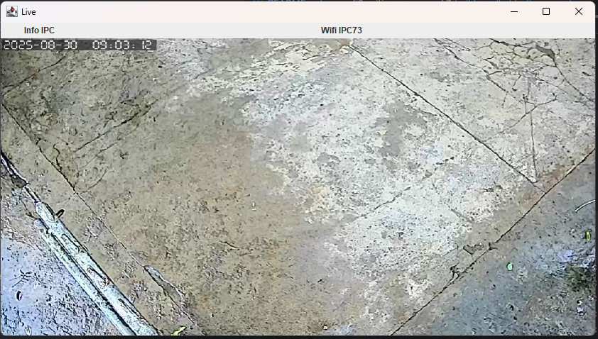

# IPCamera



`ipcamera` là ứng dụng Java cho phép bạn **xem camera IP ONVIF cơ bản**, bao gồm các tính năng:

- Xem video camera qua **RTSP**
- Lấy thông tin **Device** (Manufacturer, Model, Firmware…)
- Lấy thông tin **Network** (IP, MAC, Wi-Fi)
- Điều khiển **PTZ** (Pan, Tilt, Zoom) ↑ ↓ ← → nếu camera hỗ trợ

Ứng dụng được build dưới dạng **fat JAR** cho Windows, tích hợp các thư viện native cần thiết.

---

## Yêu cầu

- Java 17 hoặc mới hơn
- Camera hỗ trợ **ONVIF**
- Biết **IP, username và password** của camera

---

## Chạy ứng dụng

Mở terminal / command prompt trong thư mục chứa file JAR và chạy lệnh:

```bash
java -jar ipcamera-1.0.0-windows.jar <camera-ip> <username> <password>
